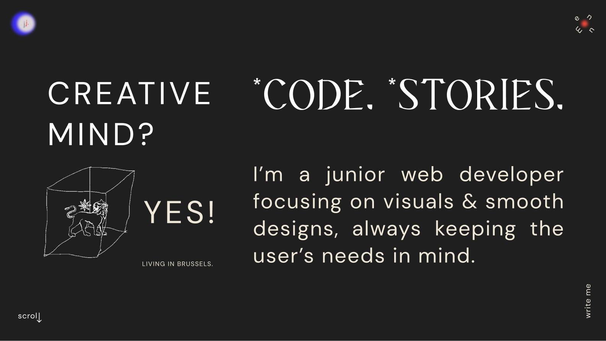
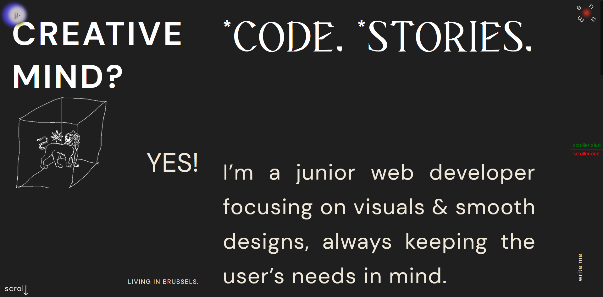
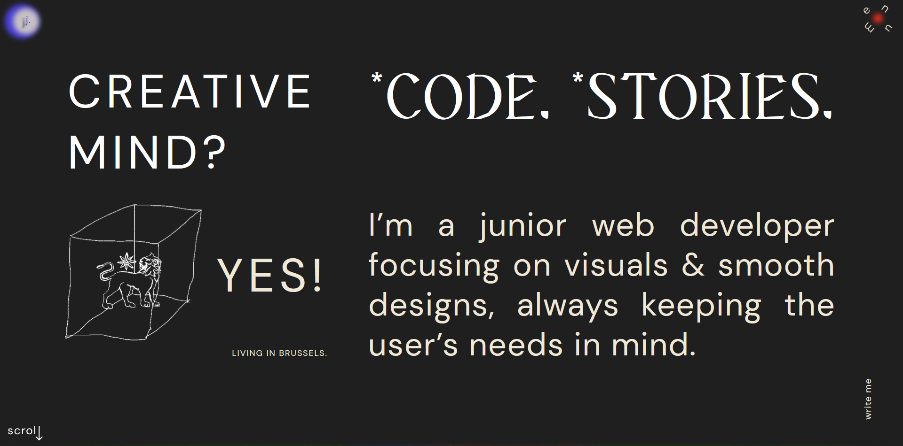
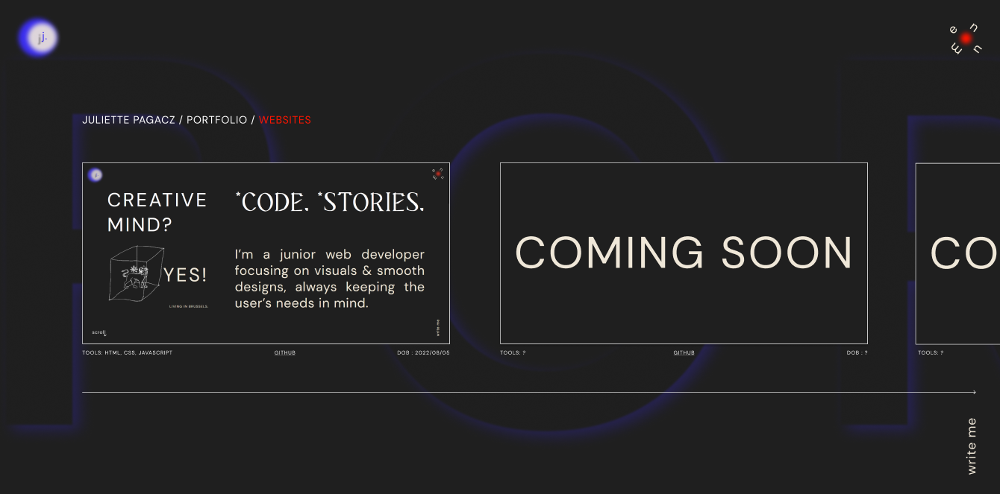
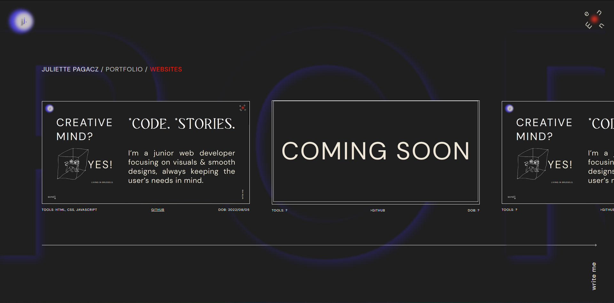

# juliettepagacz-online

I have been working on my website for sometime now, but keep in mind this is still in experimenting mode.
Due date: 05/08/2022 (today is the 27/07/2022).

The home page should look like this on 05/08 (this design was made on 28/07/2022)
</img>

Now the homepage looks like this (29/07/22 11.31am)
</img>

Now the homepage looks like this (30/07/22 11.28pm)

There, that's all done! :) For the CSS and HTML... From now, I still have to build the three other pages and then I'll finally add some JS (31/07/22 12.29pm)

Designed the second page on Figma during the afternoon (31/07/2022 5pm)

And the second page is already almost done (for HTML & CSS, but JS still missing.) (31/07/2022 9.30pm)
